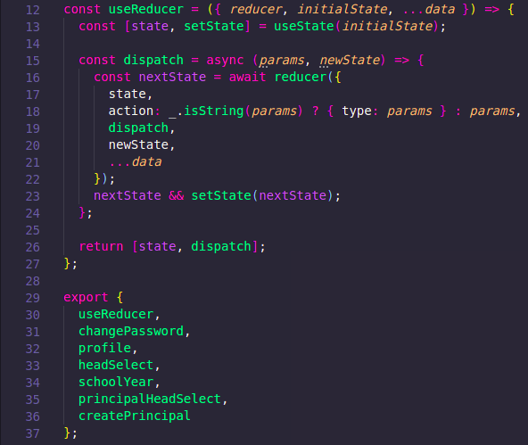
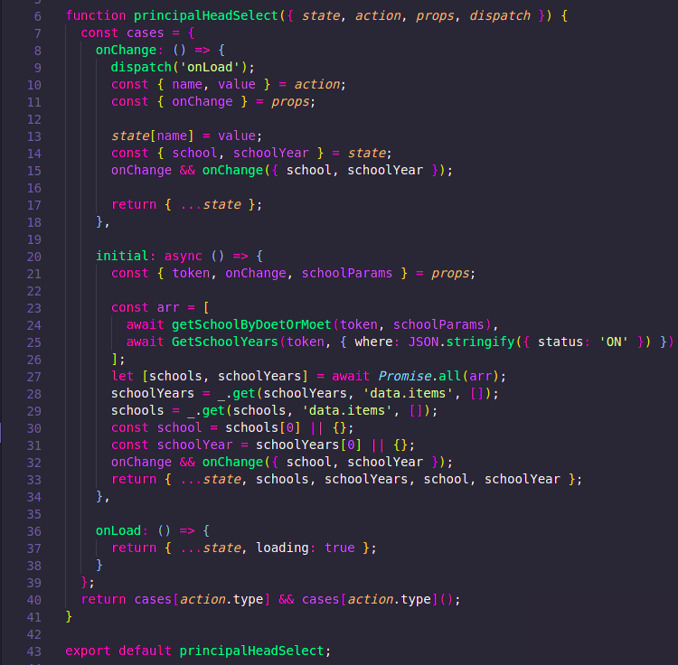
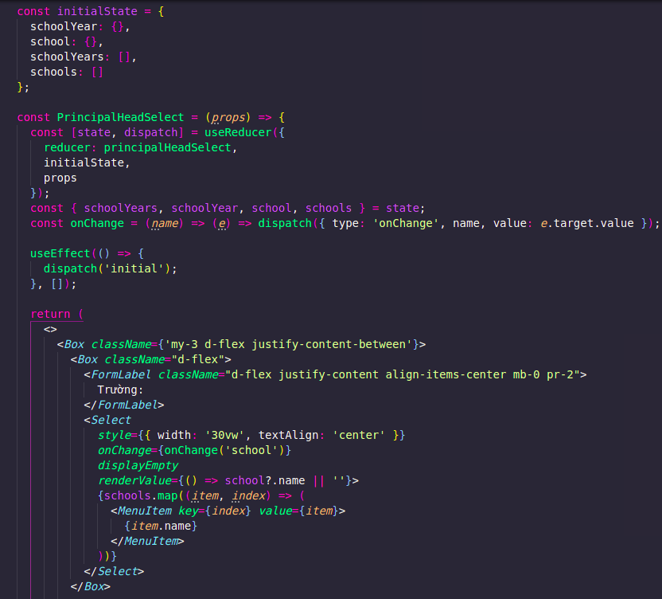
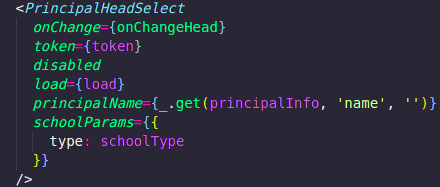

# This is how I use custom reducer to get API in ReactJS

## Create custom Reducer

Create folder __reducer__ with file __index.ts__, build custom reducer, this reducer will mantain all children reducer

## Children reducer

After create parent, I create filename __principalHeadSelect.ts__ in same folder, that mean this reducer will handle data or API for `select` field Material UI. This reducer will initial data, handle onChange when click `Select` field

## Component receive reducer

We have to create an component to pass props to reducer. That why we need to create __principallHeadselect.tsx__ in __component__ folder. This file will dispatch to reducer with `type` `state` `action`

## Import component to parent component

At this case, we import component to parent component with to pass props to children component like `token` object of `principalName` get from principal Info `schoolParams`

